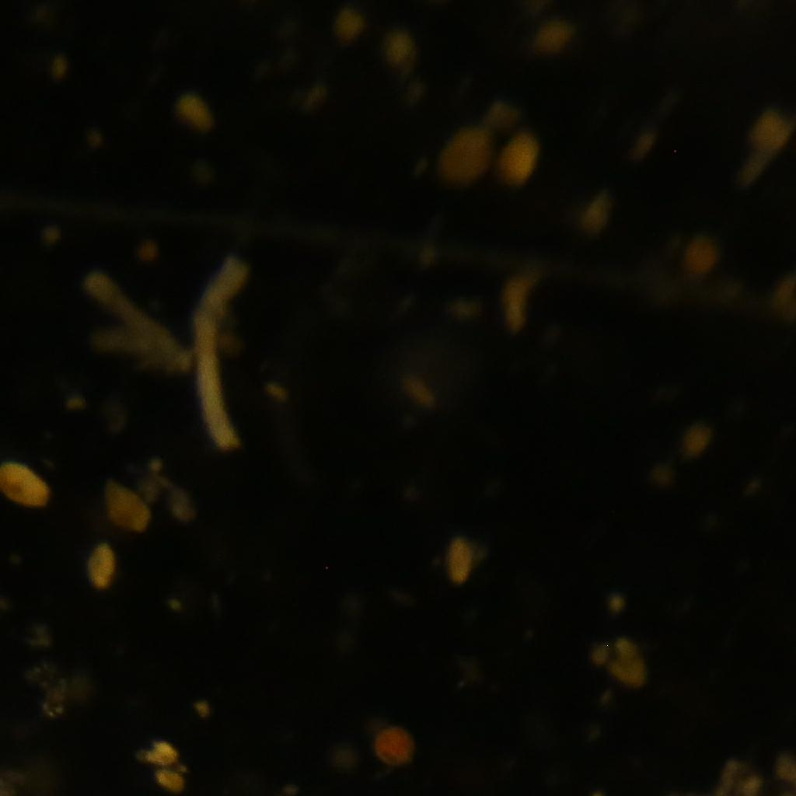

# Cristian Del Gobbo Portfolio

## About Me
I am a passionate data science student pursuing a double major in Data Science and Mathematics, with a minor in Business Administration. My academic and professional journey has equipped me with a strong foundation in analytical thinking, problem-solving, and technical expertise.

## Education
### Lyon College
- Double Major: Data Science and Mathematics
- Minor: Business Administration
- Expected Graduation: May 2026
- GPA: 4.0

## Research and Publications
### Automated Assessment of Artifacts using AI (Not Published Yet)
**Description:**
This research investigates the comparative effectiveness of grades and feedback provided by human professors versus those generated by a custom Generative AI (GAI) model, specifically a custom GPT model developed by OpenAI. The study focuses on the quality, accuracy, and usefulness of feedback, as well as the consistency and reliability of grading in an educational context.

**Key Components:**
- Synthetic Artifact Creation: Developed synthetic student artifacts using advanced prompt-engineering techniques with GPT-4o, ensuring diversity and realism in the simulated student work.
  
- Grading Process: Utilized a custom grader-GPT to evaluate the synthetic artifacts, comparing the results with grades and feedback provided by experienced human professors.
  
- Statistical Analysis: Employed Intraclass Correlation Coefficient (ICC) for reliability assessment, Pearson correlation for linear comparisons, and ANOVA to identify significant differences in grading patterns. Paired t-tests were used to compare feedback ratings.
  
- Evaluation: Engaged additional professors to assess the accuracy and usefulness of feedback from both human graders and the grader-GPT, ensuring a comprehensive evaluation of the AI's performance in educational assessment.
  
**Significance:**
This research aims to enhance the understanding of AI's role in educational assessment, providing insights into the potential for AI-driven tools to improve the efficiency and quality of grading and feedback processes. The findings have implications for integrating AI in educational settings, ultimately contributing to better learning outcomes and reduced workload for educators.

### Plankton Carbon decay analysis through deep learning models (Not published Yet) 
**Description:**
This research project, conducted in collaboration with one of my professors and international researchers, focuses on developing a deep learning model to detect and classify plankton species from microscopic images. The objective is to automate the process of identifying various plankton types to support marine biology research and environmental monitoring. (Details in Project 3 section)

**Significance:**
This project demonstrates the transformative potential of deep learning in marine biology by automating the identification of plankton species, a task traditionally reliant on manual labor and expertise. The ability to accurately and efficiently classify plankton from microscopic images supports large-scale ecological studies and environmental monitoring efforts. By leveraging advanced machine learning models and international collaboration, this research contributes to the broader understanding of marine ecosystems and aids in the development of sustainable environmental practices.

## Projects
*Note:* Projects are ranked by importance and difficulty (Not exactly, but it's a good rule of thumb). Therefore, the most relevant and challenging projects are listed within the first 7-8 positions.

### Project 1: GPT-2 Local Replication (Python)
**Description:**
In this project, I replicated a GPT-2 model following the detailed instructions provided by Andrej Karpathy in one of his [tutorial videos](https://youtu.be/l8pRSuU81PU?si=aH1r8OYISL3pokbB). The primary objective was to understand and implement a GPT-2 model locally, focusing on text generation tasks.

The project closely mirrors the structure and implementation found in [Karpathy's GitHub repository](https://github.com/karpathy/build-nanogpt), ensuring a comprehensive grasp of the underlying mechanics of GPT-2.

**Key Features:**
- Implemented a GPT-2 architecture: Followed Andrej Karpathy's tutorial to build a robust transformer model.
- Used TikToken for encoding: Leveraged the TikToken encoding method for efficient and accurate tokenization of the input text.
- Distributed Data Parallel (DDP): Utilized DDP to optimize the training process across multiple GPUs.
- Flash Attention Mechanism: Implemented Flash Self-Attention to enhance the efficiency of attention computation.
- Adaptive Learning Rate: Devised a learning rate schedule with linear warmup and cosine decay to ensure optimal training performance.
  
**Technologies Used:**
- Python
- PyTorch
- TikToken
- Distributed Data Parallel (DDP)
- Transformer Model (GPT-2)

**Project Outcomes:**
- Successfully replicated a GPT-2 model capable of generating coherent and contextually relevant text.
- Validated the effectiveness of GPT-2 models for natural language processing tasks.
- Demonstrated the practical implementation of advanced tokenization and attention mechanisms.

**Learnings:**
- Acquired in-depth knowledge of GPT-2 model architecture and its implementation.
- Enhanced understanding of tokenization methods and their impact on model performance.
- Improved skills in optimizing machine learning models for distributed environments.

**Code:**
[View the code on GitHub](https://github.com/cris1618/Projects-Code/blob/main/GPT2-Replication/train_GPT-2.py)

### Project 2: NanoGPT (Python)
**Description:**
In this project, I trained a decoder-only transformer model following the principles outlined in the seminal paper "Attention Is All You Need" by Vaswani et al. The goal was to generate coherent and contextually relevant text based on Shakespearean language.

To enhance the precision of the model, I utilized the TikToken encoding method instead of traditional single-character encoding. This approach allowed for a more granular and meaningful representation of the text, improving the overall quality of the generated content.

**Key Features:**
- Implemented a transformer architecture focusing solely on the decoder mechanism for text generation.
- Leveraged TikToken for more precise tokenization and encoding, improving model accuracy.
- Utilized PyTorch for model development, training, and evaluation.
- Optimized hyperparameters to ensure efficient training on a CPU-based environment.

**Technologies Used:**
- Python
- PyTorch
- TikToken
- Transformer Model (Decoder-Only)
- Shakespeare Text Dataset

**Project Outcomes:**
-Successfully trained a language model capable of generating Shakespeare-like text.
-Demonstrated the effectiveness of transformer models for natural language processing tasks.
-Showcased the benefits of using advanced tokenization techniques for improving model precision.

**Learnings:**
-Gained deep insights into the implementation of transformer models.
-Enhanced understanding of tokenization methods and their impact on model performance.
-Improved skills in optimizing machine learning models for resource-constrained environments.

**Code:**
[View the code on GitHub](https://github.com/cris1618/Projects-Code/blob/44cc270434af585f9141b71d5ff38e590beb14e1/NanoGPT/ShakeTikToken.py)

### Project 3: VizBeuty: Python Package for Enhanced Visualizations 
**Description:**
VizBeauty is a sophisticated Python toolkit designed to enhance data visualization and analysis. This package offers a comprehensive suite of functions tailored to meet diverse analytical needs with precision and efficiency. By integrating advanced statistical methods and customizable plotting capabilities, VizBeauty facilitates in-depth data exploration and provides valuable insights across various datasets. VizBeauty is publicly available on PyPI, making it easily accessible for all users.

**Tools and Technologies Used:**
- Python: Core programming language for development.
- Pandas: For data manipulation and analysis.
- NumPy: For numerical operations.
- Seaborn: For statistical data visualization.
- Matplotlib: For creating static, animated, and interactive visualizations.
- SciPy: For advanced statistical computations.
- Git: Version control.
  
**Key Insights and Outcomes:**
- Descriptive Statistics: Function to print detailed descriptive statistics, providing insights into the distribution and characteristics of datasets.
  
- Bar Plot with Annotations: Customizable bar plot function with annotations and average value indicators, enhancing data interpretability.
  
- Pearson Correlation: Function to compute and determine the statistical significance of Pearson correlation coefficients, aiding in the identification of relationships between variables.
  
- Scatter Plot with Regression Line: Advanced scatter plot function that includes regression lines and supports additional parameters such as hue and size for deeper analysis.
  
- Hyperparameter Visualization: Function to visualize the impact of hyperparameters on model performance, facilitating more effective model tuning.
  
These functions collectively empower users to perform comprehensive data analysis and visualization, leading to actionable insights and informed decision-making.

*Example of a package function visualization:*

**Code:**
[View the code on GitHub](https://github.com/cris1618/VizBeauty-)

### Project 4: Ocean Vision (Python)
**Description:**
This research project, conducted in collaboration with one of my professors and international researchers, focuses on developing a deep learning model to detect and classify plankton species from microscopic images. The objective is to automate the process of identifying various plankton types to support marine biology research and environmental monitoring.

**Tools and Technologies Used:**
- Programming Languages: Python
- Deep Learning Frameworks: PyTorch, Torchvision
- Models: Faster R-CNN with ResNet-50 backbone
- Data Processing: Pandas, NumPy
- Image Processing: PIL (Python Imaging Library)
- Evaluation Metrics: Mean Average Precision (mAP), Multiclass AUPRC (Average Precision)
- Hardware: GPU for training acceleration
- Additional Libraries: Torcheval for evaluation, Matplotlib for visualizations
  
**Key Insights and Outcomes:**
- Successfully implemented and trained a Faster R-CNN model tailored for plankton detection and classification.
  
- Achieved initial baseline performance metrics, indicating the potential for high-accuracy classification with further training and data augmentation.
  
- Demonstrated the effectiveness of transfer learning by utilizing a pre-trained ResNet-50 backbone, significantly reducing the training time and computational resources required.
  
- Highlighted the importance of data preprocessing and augmentation in enhancing model performance for small and imbalanced datasets.
  
- Provided valuable insights into the application of deep learning techniques in marine biology, paving the way for future research and development in automated species identification.

*Sample of a plankton Image to analyze:*

  **Code**: 
The code for this project is private 

### Project 5: InsightVisualizer (Python)
**Description:**
In this project, I explore the correlations between various socio-economic indicators such as life expectancy, GDP per capita, and happiness score across different countries using two distinct datasets: "Life expectancy.csv" and "Suicide Rate.csv". Through meticulous analysis, these datasets are merged to construct a unified view of global socio-economic dynamics, uncovering underlying patterns and correlations.

While the project does not draw definitive conclusions due to potential inaccuracies in certain data columns, it leverages visualizations, custom functions, and machine learning techniques to extract valuable insights. Strong correlations are observed between life expectancy, GDP per capita, and happiness score, indicating significant associations among these factors. However, minimal to no discernible relationship is found between other variables and suicide rate, possibly influenced by the nature of the data.

**Tools and Technologies Used:**
- Python: Core programming language for development.
- Pandas: For data manipulation and analysis.
- NumPy: For numerical operations.
- Seaborn: For statistical data visualization.
- Matplotlib: For creating static, animated, and interactive visualizations.
- SciPy: For advanced statistical computations.
- Scikit-learn: For implementing machine learning models.
- XGBoost: For gradient boosting machine learning models.
- Random Forest Regressor: For ensemble learning methods.
  
**Key Insights and Outcomes:**
- Data Merging and Cleaning: Combined two datasets to create a comprehensive view of socio-economic factors.
  
- Descriptive Statistics and Visualizations: Generated detailed statistics and visualizations to understand data distributions and identify outliers.
  
- Correlation Analysis: Discovered strong correlations between life expectancy, GDP per capita, and happiness score, and minimal correlations involving suicide rates.
  
- Machine Learning Models: Developed models to predict life expectancy, GDP per capita, and happiness score, achieving promising performance metrics despite the limited data.
  
- Feature Importance Analysis: Identified key features impacting the prediction models, highlighting the significance of happiness score, fertility rate, and GDP per capita in influencing life expectancy and happiness.

*Heatmap taken from the project*

**Code:**
[View the code on GitHub](https://github.com/cris1618/Projects-Code/blob/main/InsightVisualizer/Notebook.ipynb)

### Project 6: IQ and Income: Unraveling Correlations and Thresholds (Python)
**Description:**
This project focuses on exploring correlations and analyzing the statistical significance of key socio-economic variables. Specifically, it investigates the relationship between intelligence quotient (IQ) and average income, alongside the impact of education expenditure and average temperature on income levels.

**Tools and Technologies Used:**
- Python: Core programming language for development.
- Pandas: For data manipulation and analysis.
- NumPy: For numerical operations.
- Matplotlib: For creating static and interactive visualizations.
- Seaborn: For statistical data visualization.
- SciPy: For advanced statistical computations.

**Key Insights and Outcomes:**
- Positive correlation (0.56) between IQ and average income, suggesting an association between intelligence and income levels.
  
- Stronger correlation (0.86) between education expenditure and average income, highlighting the significant impact of investments in education on income.
  
- Negative correlations (-0.44 between average temperature and average income, and -0.63 between IQ and average temperature), indicating potential influences of
environmental factors on income levels. These correlations underscore associations rather than causal relationships, providing valuable insights into socio-economic dynamics.

*IQ vs Average Income (logarithmic scale)*

**Code:**
[View the code on GitHub](https://github.com/cris1618/Projects-Code/blob/main/IQ-Income/notebook.ipynb)

### Project 7: Mapping the Adoption Patterns of Battery Electric and Plug-in Hybrid Vehicles in Urban, Suburban, and Rural Areas of Washington (Python)
**Description:**
This project analyzes the geographic distribution of Battery Electric Vehicles (BEVs) and Plug-in Hybrid Electric Vehicles (PHEVs) in Washington State. The objective is to determine if there is a significant difference in the adoption patterns of these vehicles across urban, suburban, and rural areas. The hypothesis is that BEVs are more prevalent in urban areas, while PHEVs are more common in suburban and rural regions.

**Tools and Technologies Used:**
- Programming Language: Python
- Pandas: For data manipulation and analysis.
- Matplotlib and Seaborn: For data visualization.
- Scipy: For conducting statistical tests.
  
**Data Sources:**
- Electric Vehicle registrations data.
- Demographic data for Washington State.
  
**Key Insights and Outcomes:**
- Distribution of EVs: The analysis revealed a significant difference in the distribution of BEVs and PHEVs across different area types. BEVs are more prevalent in urban areas, while PHEVs are more common in suburban and rural areas.
  
- Statistical Analysis:
    - Chi-Square Test: Conducted to determine if there is a statistically significant difference in the distribution of BEVs and PHEVs across area types. The chi-square test results indicated a significant difference (χ² = 829.25, p < 0.001).
      
- Proportion Comparison: Compared the proportions of BEVs and PHEVs in urban, suburban, and rural areas to provide insights into their relative frequencies.
  
**Implications for the Field:**
- Infrastructure Planning: Helps in planning and optimizing charging infrastructure to meet the needs of different regions.
- Policy Development: Provides insights for policymakers to design targeted incentives and regulations to encourage EV adoption.
- Market Strategies: Allows automotive companies to tailor their marketing and distribution strategies based on regional preferences for BEVs and PHEVs.
  
**Future Possibilities:**
- Further research on factors driving distribution patterns, such as socio-economic factors and local policies.
- Enhanced data collection for deeper insights.
- Integration with smart grids for energy optimization and grid reliability.

*EV Distribution*

**Code:**
[View the code on GitHub](https://github.com/cris1618/Projects-Code/tree/main/EVDistribution)

### Project 8: Clustering Antarctic Penguin Species (Python)
**Description:**
This project supports a team of researchers collecting data about penguins in Antarctica. The task involved applying data science skills to identify groups in the dataset using K-means clustering. The dataset, provided by Dr. Kristen Gorman and the Palmer Station, Antarctica LTER, includes measurements such as culmen length, culmen depth, flipper length, body mass, and penguin sex. The goal was to help classify the penguins into the three native species: Adelie, Chinstrap, and Gentoo.

**Tools and Technologies Used:**
- Python: Data manipulation, analysis, and visualization
- Sklearn: KMeans, PCA, StandardScaler for clustering and data preprocessing
- Matplotlib: Visualization of clustering results
- Pandas: Data handling and manipulation

**Key Insights and Outcomes:**

Source: @allison_horst GitHub

By applying K-means clustering, the project successfully classified the penguins into three distinct clusters, corresponding to the three native species. This classification aids the researchers in understanding the population distribution and characteristics of the penguins in the region.

*Number of Clusters selection*

**Code:**
[View the code on GitHub](https://github.com/cris1618/Projects-Code/blob/main/AntarticPenguin/notebook.ipynb)

### Project 9: Predictive Modeling for Agriculture (Python)
**Description:**
This project involves building a machine learning model to help farmers select the best crops for their fields based on essential soil metrics. By analyzing the dataset containing nitrogen, phosphorous, potassium levels, and pH values, the goal is to predict the optimal crop type to maximize yield. The project addresses the challenge of multicollinearity among features to improve model accuracy.

**Tools and Technologies Used:**
- Python: Primary programming language for data analysis and modeling
- Pandas: For data manipulation and preprocessing
- Scikit-learn (Sklearn):
-- Logistic Regression: To build and evaluate the multi-class classification model
-- Train-Test Split: To split the dataset for training and testing
-- F1 Score: To measure model performance
- Seaborn and Matplotlib: For data visualization and creating heatmaps to analyze feature correlations
  
**Key Insights and Outcomes:**
- Successfully trained a logistic regression model to predict crop types based on soil measurements.
- Identified and addressed multicollinearity among features, selecting the best combination of features for the final model.
- Achieved a low weighted F1 score on the test data, demonstrating the model's effectiveness in predicting the optimal crop for different soil conditions.

*Feature selection Heatmap*

**Code:**
[View the code on GitHub](https://github.com/cris1618/Projects-Code/blob/main/AgriculturePred/notebook.ipynb)

### Project 10: Modeling Car Insurance Claim Outcomes (Python)
**Description:**
This project involves building a machine learning model (Only feature importances) to predict whether a customer will make a claim on their car insurance during the policy period. The model aims to optimize pricing strategies for the insurance company and improve their prediction accuracy. The dataset includes various features such as age, gender, driving experience, education, income, credit score, and vehicle ownership status. The goal is to identify the single feature that results in the best performing model, as measured by accuracy, so they can start with a simple model in production.

**Tools and Technologies Used:**
- Python: General programming and data manipulation
- Pandas: Data manipulation and analysis
- Scikit-learn: Machine learning algorithms and evaluation
- Matplotlib & Seaborn: Data visualization
- Statsmodels: Statistical modeling
  
**Key Insights and Outcomes:**
- Conducted data preprocessing including handling missing values and encoding categorical features.
- Built and evaluated multiple logistic regression models to identify the feature with the highest predictive power.
- Driving experience was identified as the single best feature, achieving an accuracy of 77.71%.
  
**Code:**
[View the code on GitHub](https://github.com/cris1618/Projects-Code/blob/main/CarModel/notebook.ipynb)

### Project 11: Predicting Movie Rental Durations (Python)
**Description:**
This project focuses on predicting the number of days a customer will rent a DVD using various regression models. The dataset includes features such as rental and return dates, amount paid, rental rate, release year, length, replacement cost, and special features. The objective is to create a model that yields a Mean Squared Error (MSE) of 3 or less on the test set to help the DVD rental company improve inventory planning.

**Tools and Technologies Used:**
- Python: For data manipulation and analysis.
- Pandas: To handle and process the dataset.
- NumPy: For numerical operations.
- Scikit-learn: For model implementation, including Lasso regression, Random Forest, and OLS regression.
- Matplotlib & Seaborn: For data visualization (though not explicitly used in this notebook).
- Jupyter Notebook: For interactive data analysis and model building.

**Key Insights and Outcomes:**
- Conducted feature engineering to create meaningful variables, such as rental length and dummy variables for special features.
  
- Implemented and evaluated multiple regression models including Lasso regression, Linear regression, and Random Forest to predict rental duration.
  
- Performed hyperparameter tuning for Random Forest using RandomizedSearchCV to optimize model performance.
  
- Achieved the lowest MSE with the Random Forest model, indicating it as the best performing model for this task.
  
- Provided actionable insights for the DVD rental company to enhance their inventory planning based on the predictive model.

**Code:**
[View the code on GitHub](https://github.com/cris1618/Projects-Code/blob/main/RentalPred/notebook.ipynb)

### Project 12: Analyzing Crime in Los Angeles (Python)
**Description:**
This project analyzes crime data in Los Angeles to identify patterns and assist the LAPD in resource allocation.

**Tools and Technologies Used:**
- Python: For data analysis.
- Pandas: For data manipulation.
- Matplotlib and Seaborn: For data visualization.

**Key Insights and Outcomes:**
- Data Cleaning: Loaded and parsed crime data, converting dates and handling time as strings.
  
- Exploratory Data Analysis (EDA): Identified the hour with the highest frequency of crimes. Determined the location with the highest crime rate. Analyzed night crime patterns and identified the most affected area. Categorized victims' ages into brackets and analyzed the distribution.
  
- Visualization: Created count plots to visualize crime occurrences by hour and victim age brackets.

*Number of crime per hour*

**Code:**
[View the code on GitHub](https://github.com/cris1618/Projects-Code/blob/main/LACrime/notebook.ipynb)

### Project 13: Visualizing the History of Nobel Prizes (Python)
**Description:**
This project focuses on analyzing data related to Nobel Prize winners. The analysis covers various aspects such as the distribution of prizes across different categories, the demographic details of the laureates, and the trends over the years. The primary goal is to uncover patterns and insights about the Nobel Prize awards.

**Tools and Technologies Used:**
- Python: The primary programming language used for data analysis.
- Pandas: For data manipulation and analysis.
- NumPy: For numerical operations.
- Matplotlib and Seaborn: For data visualization.
- Jupyter Notebook: As the development environment for running and presenting the analysis.

**Key Insights and Outcomes:**
- Data Collection
- Exploratory Data Analysis (EDA): Analyzed the distribution of Nobel Prizes across different categories (Chemistry, Literature, Physics, etc.).
- Visualization: Created informative visualizations to highlight key findings, such as bar charts, histograms, and line plots.

*Proportion of Female Winner per Category*

**Code:**
[View the code on GitHub](https://github.com/cris1618/Projects-Code/blob/main/NobelPrize/notebook.ipynb)

### Project 14: Hypotesis Testing with Men's and Women's soccer Matches (Python)
**Description:**
This project analyzes whether more goals are scored in women's international soccer matches compared to men's. The analysis is based on official FIFA World Cup match data since January 1, 2002.

**Tools and Technologies Used:**
- Python: For data analysis.
- Pandas: For data manipulation.
- Matplotlib: For data visualization.
- SciPy: For statistical testing.
  
**Key Insights and Outcomes:**
- Data Collection: Used datasets containing results of official men's and women's FIFA World Cup matches.
  
- Exploratory Data Analysis (EDA): Combined men's and women's datasets for comparative analysis. Calculated the total goals scored in each match.
  
- Statistical Analysis: Conducted a Mann-Whitney U test to compare the number of goals scored in men's and women's matches.
  
- Visualization: Created histograms to visualize the distribution of goals scored in both men's and women's matches.

*Distribution of total goals in World Cup matches*

**Code:**
[View the code on GitHub](https://github.com/cris1618/Projects-Code/blob/main/SoccerAnalysis/notebook.ipynb)

### Project 15: Exploring NYC Public School test Results Scores (Python)
**Description:**
This project analyzes SAT scores of American high school students to identify trends and insights. The analysis focuses on the scores across different sections and explores factors that might influence performance.

**Tools and Technologies Used:**
- Python: For data analysis.
- Pandas: For data manipulation.

**Key Insights and Outcomes:**
- Data Collection: Utilized datasets containing SAT scores of high school students.
- Exploratory Data Analysis (EDA): Analyzed SAT scores across different sections: literacy, numeracy, and writing.

*SAT Scores in New York's Borough*

**Code:**
[View the code on GitHub](https://github.com/cris1618/Projects-Code/blob/main/NYCTestScore/notebook.ipynb)

### Project 16: Dr. Semmelweis and the Importance of Handwashing (R)
**Description:**
This project reanalyzes historical data to examine the impact of handwashing, as discovered by Dr. Ignaz Semmelweis, on reducing childbed fever at the Vienna General Hospital in the 1840s.

**Tools and Technologies Used:**
- R: For data analysis and visualization.
- Tidyverse: For data manipulation and visualization.

**Key Insights and Outcomes:**
- Data Loading: Loaded datasets containing yearly and monthly births and deaths data from two clinics at the Vienna General Hospital.
  
- Data Cleaning and Transformation: Created columns to calculate the proportion of deaths relative to births. Added a column to mark the start of handwashing.
  
- Exploratory Data Analysis (EDA): Visualized the proportion of deaths over time by clinic and overall. Analyzed the impact of handwashing by comparing death proportions before and after its introduction.
  
- Visualization: Plotted the proportion of deaths over time using line graphs. Highlighted the change in mortality rates after handwashing was implemented.

*Handwashing Impact*

**Code:**
[View the code on GitHub](https://github.com/cris1618/Projects-Code/blob/main/CleanData/notebook.ipynb)

### Project 17: When Was the Golden Era of Video Games? (SQL)
**Description:**
This project analyzes video game critic and user scores, as well as sales data, for the top 400 video games released since 1977. The goal is to identify trends in game quality and sales, and to explore whether there is a "golden age" of video games.

**Tools and Technologies Used:**
- SQL: For data querying and analysis.

**Key Insights and Outcomes:**
- Data Queries: Extracted the top 10 best-selling games. Analyzed the top years by average critic scores. Compared years with high critic and user scores to identify potential golden years.
  
- Analysis:
  - Best-Selling Games: Identified the games with the highest sales numbers.
  - Top Critic Years: Determined which years had the highest average critic scores for games with at least five releases.
  - Golden Years: Found years where the average critic or user score was exceptionally high and compared the differences between critic and user scores.

*Golden Years in Video Games*

 
**Code:**
[View the code on GitHub](https://github.com/cris1618/Projects-Code/blob/main/VideoGamesSQL/notebook.ipynb)

### Project 18: Analyzing Students' Mental Health (SQL)
**Description:**
This project analyzes mental health data from a survey of international and domestic students at a Japanese international university. The goal is to explore the impact of being an international student on mental health, social connectedness, and acculturative stress.

**Tools and Technologies Used:**
- SQL: For data querying and analysis.

**Key Insights and Outcomes:**
- Data Queries: Extracted counts of undergraduate and graduate students. Compared the number of international and domestic students. Calculated average scores for depression (PHQ-9), social connectedness (SCS), and acculturative stress (ASISS) for both international and domestic students. Analyzed the relationship between the length of stay and mental health scores for international students.
  
- Analysis:
  - Student Demographics: Determined the distribution of students by academic level and origin (international vs. domestic).
  - Mental Health Scores: Found that international students had different average scores for depression, social connectedness, and acculturative stress compared to domestic students.
  - Length of Stay: Investigated how the length of stay in Japan affected mental health indicators for international students.

*Depression average test scores*

 
**Code:**
[View the code on GitHub](https://github.com/cris1618/Projects-Code/blob/main/MentalHealth/notebook.ipynb)

### Project 19: Analyzing Motorcycle Part Sales
**Description:**
This project analyzes sales data for a company selling motorcycle parts to understand wholesale revenue by product line, month, and warehouse. The analysis aims to calculate the net revenue from wholesale orders, considering the payment fees associated with different payment methods.

**Tools and Technologies Used:**
- SQL: For data querying and analysis.

**Key Insights and Outcomes:**
- Data Queries:
  - Extracted relevant columns from the sales data, including product line, order date, warehouse, client type, total price, and payment fee.
  - Converted the order dates to corresponding months (June, July, August).
  - Filtered the data to include only wholesale orders.
  - Calculated the net revenue by subtracting payment fees from the total price.
  - Grouped results by product line, month, and warehouse.
    
- Query Output:
  - The query output presents the net revenue for each product line, grouped by month and warehouse, allowing the company to gain insights into their wholesale revenue distribution.

*Revenues per product type*

**Code:**
[View the code on GitHub](https://github.com/cris1618/Projects-Code/blob/main/MotorCycleSQL/notebook.ipynb)

### Project 20: Customer Analytics: Preparing Data for Modeling (Python)
**Description:**
This project focuses on cleaning and optimizing a large customer dataset for efficient storage and analysis. The dataset is intended for predicting whether students are looking for a new job.

**Tools and Technologies Used:**
- Python: For data cleaning and optimization.
- Pandas: For data manipulation.

**Key Insights and Outcomes:**
- Data Cleaning: Loaded the customer dataset and created a copy for cleaning. Converted data types to more memory-efficient formats (e.g., integers to int32, floats to float16). Categorized columns with predefined orderings for better analysis and storage efficiency.
  
- Optimization: Filtered the dataset to include students with at least 10 years of experience and who work in companies with 1000-4999 employees.

**Code:**
[View the code on GitHub](https://github.com/cris1618/Projects-Code/blob/main/CleanData/notebook.ipynb)
